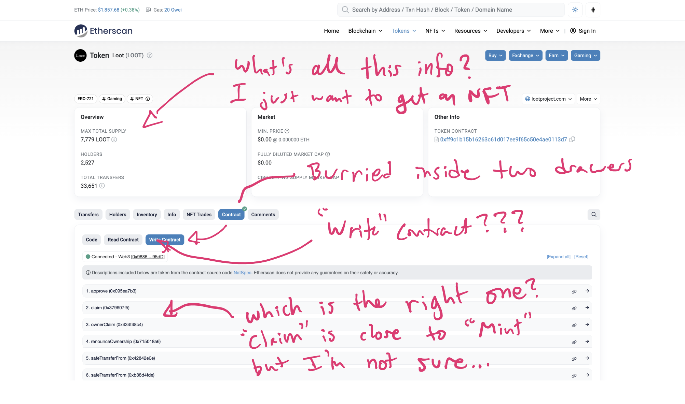

import FirstParagraph from "../../components/FirstParagraph.astro";

<FirstParagraph text="Anyone who's called a smart contract method on Etherscan knows how frustrating it can be." />

1. **They're hard to find**. Methods are hidden under the fold, behind a bunch of nerd words.
2. **They're hard to understand**. You're left to decrypt the method names to find the right one.
3. **There's no feedback**. Transactions take time, but Etherscan doesn't give updates, leaving you feeling anxious and confused.

We refused to believe that this was the best solution. We thought, "Wait, aren't these 'methods' just mini forms?"

**Why couldn't we make Google Forms, but for smart contracts?"**

## Challenges

Crafting a friendly, focused experience was table stakes, but other requirements made it extra challenging:

### Trust vs Ease

The biggest risk is bad actors using Formie to misrepresent a contract and scam people.
But, you don't want to overwhelm people with technical details.

- How much detail to you share? What information is essential for every user?
- How do you protecting users from scammers (and themselves) while crafting a seamless experience?

**Solution**: link to contract, make it clear what it's doing, but with the right framing, you can have it both ways

### Universality

Every method had different needs & context, but needs a universal interface.

- How do you create an interface, voice, and aesthetic that works, regardless of the method? (univesally approachable)?

**Solution**: Balanced voice, stripped-back aesthetic, custom copy (flexible communication)

## Here are some big decisions we made

I made several key design decisions to improve the user experience:

- **Just a regular form**: Wrap single methods into standalone forms.

- **Human words**: Ditched technical terms like "Method" and "Writing". Let people give forms their own title and descriptions to allow explanation.

- **Trust > seamlessness**: I ensured that users knew who they were sending money to by linking to the contract and requiring trust confirmation.
- Clear transaction feedback: I worked on creating anxiety-relieving copy and ensuring non-technical users could understand and act on the information provided.

## Process

1. I sketched out the high-level UI/flow
2. Batching & sequencing pages/functionality
3. Code & design scope-by-scope

## Solution

The answer was simple: Wrap a familiar form around the smart contract. I realized that smart contract methods were just like web forms, so why not make them more accessible by using a form-based approach?

To make Formie more intuitive, I:

- Created single pages for single methods, avoiding the confusion of having all methods on one page.
- Focused on a visually appealing UI to build trust and enhance the user experience.

## Things we left out

Time was my biggest constraint, which led to several tradeoffs:

### Custom field titles and descriptions

Comparing to the baseline, having the Formie package and the same fields was still an improvement for Etherscan users.

### Editing form content

I wanted to allow for custom titles, descriptions, submit buttons, and fields, but implementing authentication would have taken too long.
Tradeoff: Permanent forms with added form titles and descriptions (acceptable since users could create unlimited forms)

### Remembering pending transactions when users leave the page

Most transactions were short enough that users wouldn't navigate away, and the pending transaction copy helped ease users' concerns.
